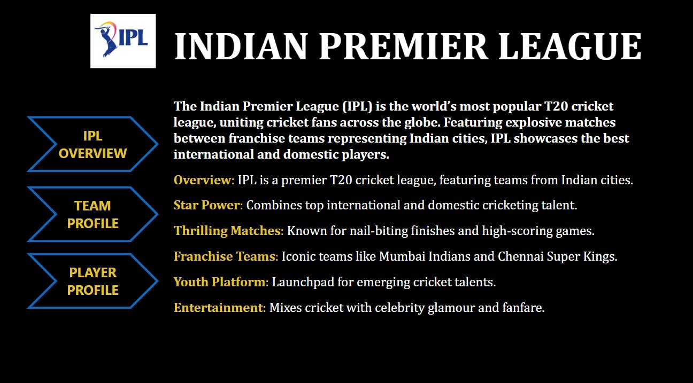
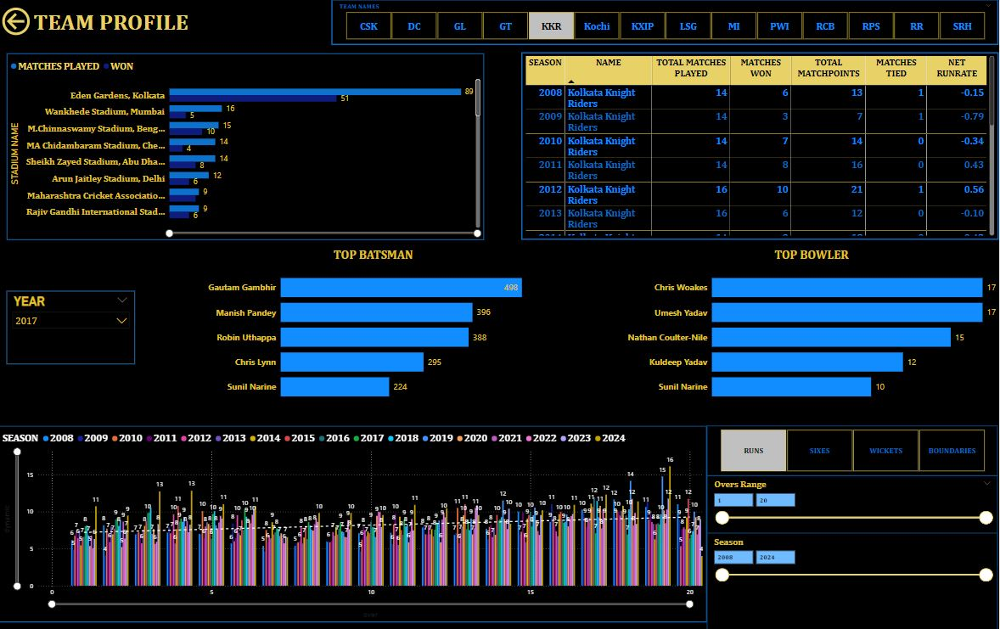
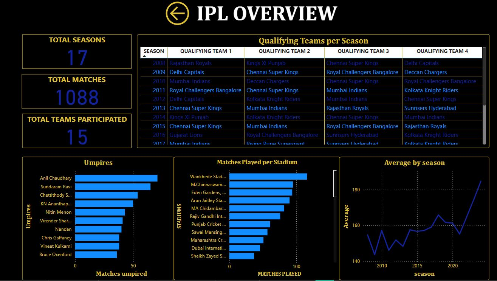

# IPL Dashboard - Power BI Project

## Overview
This Power BI project provides a comprehensive analysis of the Indian Premier League (IPL), showcasing key insights and statistics across various dimensions such as team performance, player comparisons, stadium metrics, and seasonal trends. The project features a **Homepage** that links seamlessly to the following detailed sections:
- **Team Profile**
- **Player Profile**
- **IPL Overview**

## Features
### 1. **Homepage**
The central hub of the dashboard, where users can navigate to different analytical views:
- **Team Profile**
- **Player Profile**
- **IPL Overview**



### 2. **Team Profile**
- Displays team-specific statistics such as matches played, wins, and performance by stadiums.
- Highlights top-performing batsmen and bowlers for each selected team and season.
- Allows filtering by year to analyze team trends over different IPL seasons.


### 3. **Player Profile**
- A player-versus-player analysis module where users can compare specific batsmen and bowlers.
- Provides detailed stats like balls played, runs scored, boundaries hit, wickets taken, and strike rate for each matchup.
- Filter by season to explore historical player performances.


### 4. **IPL Overview**
- A holistic view of IPL data, including:
  - Total seasons, matches, and teams participated.
  - Season-wise qualifying teams for playoffs.
  - Matches played per stadium and umpire statistics.
  - Seasonal averages for runs, sixes, wickets, and boundaries.



## Technologies Used
- **Power BI Desktop**: For creating interactive dashboards and visualizations.
- **Data Sources**: IPL datasets mentioned in the directory.

## Usage

1. **Select Season**: Choose a specific IPL season or explore all seasons.
2. **Filter Teams/Players**: Narrow down statistics by selecting specific teams or players.
3. **View Visualizations**: Explore interactive charts and graphs for trends and insights.
4. **Compare Performances**: Use side-by-side comparisons of players or teams.

---

## Future Improvements
- Add predictive analytics for upcoming IPL seasons.
- Incorporate additional datasets for deeper insights, such as audience engagement metrics.

## Steps to Run the Report

### **Step 1: Clone or Download the Repository**
1. Clone the repository using:
   ```bash
   git clone (https://github.com/MitaliMalusare/IPL_DASHBOARD.git)
   ```
---

### **Step 2: Install Power BI Desktop**
- Ensure you have [Power BI Desktop](https://powerbi.microsoft.com/) installed on your system. You can download it for free from the official website.
---

### **Step 3: Open the `.pbix` File**
1. Launch Power BI Desktop.
2. Open the file IPL_Dashboard.pbix
---

### **Step 4: Explore the Report**
- Use the interactive visualizations and slicers to analyze the churn data.
- Navigate between pages in the report to explore different insights.

---
For any queries or suggestions, feel free to reach out!!
